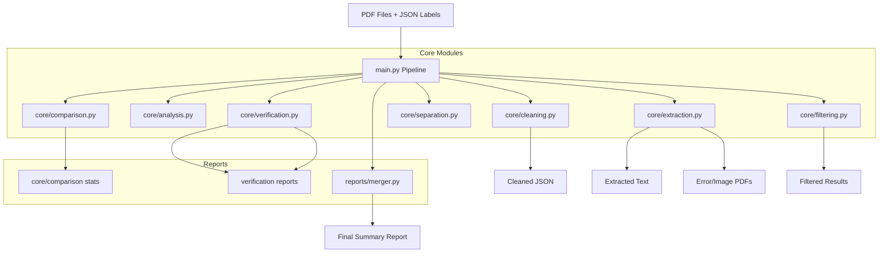

# Architecture Documentation - Invoice Data Audit Tool

## System Overview

Invoice Data Audit Tool là hệ thống xử lý và kiểm tra chất lượng dữ liệu hóa đơn tự động. Hệ thống sử dụng kiến trúc modular với các module độc lập có thể chạy riêng lẻ hoặc kết hợp trong pipeline.

## Data Flow Diagram



## Module Architecture

### Main Entry Point

#### 0. Pipeline Controller (`main.py`)

**Trách nhiệm**: Điều phối toàn bộ quy trình xử lý tuần tự.

**Workflow**:

1. `core.cleaning`: Chuẩn hóa dữ liệu JSON đầu vào.
2. `core.analysis`: Thống kê sơ bộ.
3. `core.extraction`: Trích xuất text (PyMuPDF).
4. `core.verification`: Đối soát Logic Fuzzy Match.
5. `core.separation`: Di chuyển file lỗi/thiếu.
6. `core.filtering`: Lọc kết quả và phân loại file đã verify.
7. `core.comparison`: So sánh tổng hợp Dataset vs Label.
8. `reports.merger`: Tổng hợp báo cáo cuối cùng.

---

### Core Layer (`core/`)

#### 1. Configuration Module (`config.py`)

**Trách nhiệm**: Quản lý tất cả đường dẫn và cấu hình hệ thống (Sử dụng `pathlib`).

**Key Constants**:

```python
BASE_DIR          # Thư mục gốc project
DATASET_DIR       # PDF files
LABEL_DIR         # JSON labels
REVIEW_DIR        # Output reports
EXTRACTED_TEXT_DIR # Extracted text files
```

#### 2. Utilities Module (`utils.py`)

**Trách nhiệm**: Cung cấp hàm tiện ích dùng chung (File Ops, Date/Text Processing).

---

### Processing Layer (`core/`)

#### 3. Analysis Module (`core/analysis.py`)

**Input**: Directories (Dataset, Label)
**Output**: CSV statistics, Text report

**Workflow**:

1. Scan directories
2. Collect file metadata (size, extension, basename)
3. Calculate statistics (count, size range, duplicates)
4. Generate report

#### 4. Comparison Module (`core/comparison.py`)

**Input**: Dataset and Label directories
**Output**: File differences report

**Workflow**:

1. Get file maps from both directories
2. Extract basenames
3. Find set differences (Missing in Label vs Missing in Dataset)
4. Generate detailed report

#### 5. Extraction Module (`core/extraction.py`)

**Input**: PDF files
**Output**: Text files, Error reports, Image PDF separation

**Workflow**:

1. List all PDFs recursively
2. Extract text using `fitz` (PyMuPDF)
3. Classify: Text PDF / Image PDF / Error PDF
4. Move to appropriate folder (`Extracted_Text`, `PDF_Image_Files`, `PDF_Error_Files`)

#### 6. Verification Module (`core/verification.py`)

**Input**: JSON labels, Extracted text files
**Output**: Verification CSV, Statistics report

**Workflow**:

1. Load JSON and Text
2. For each field: Match Value vs Text (Fuzzy, Date, Numeric)
3. Record Status (FOUND, SIMILAR, MISSING)
4. Generate `label_verification_report.txt` stats

#### 7. Cleaning Module (`core/cleaning.py`)

**Input**: JSON files
**Output**: Cleaned JSON files, Log

**Workflow**:

1. Scan JSON files
2. Convert string numbers to float/int (handling commas)
3. Validate Date formats
4. Save changes if any

#### 8. Separation Module (`core/separation.py`)

**Input**: File Maps
**Output**: Organized directories (Missing files, Docx files)

**Workflow**:

1. Identify files missing labels or PDFs
2. Move valid/invalid files to respective folders

#### 9. Deduplication Module (`core/deduplication.py`)

**Input**: JSON labels
**Output**: Duplicate report, Moved duplicates

**Workflow**:

1. Hash JSON content (MD5)
2. Identify duplicates
3. Consolidate to unique set

#### 10. Filtering Module (`core/filtering.py`)

**Input**: Verification CSV
**Output**: Filtered CSVs, Verified File Set

**Workflow**:

1. Split results into Missing/Similar CSVs
2. (Optional) Move fully verified files to `Label_true` folder

---

### Reporting Layer (`reports/`)

#### 11. Generator & Merger (`reports/generator.py`, `reports/merger.py`)

**Trách nhiệm**:

- `generator.py`: Tạo báo cáo Markdown tổng quan và chi tiết lỗi.
- `merger.py`: Gộp các file text report thành `final_summary.txt`.

---

## Matching Algorithms

### Date Matching

**Strategy**: Multi-format parsing with normalization

**Supported Formats**: See [supported_date_formats.md](supported_date_formats.md)

**Algorithm**:

```python
1. Parse JSON date to datetime object
2. Generate multiple format variations:
   - DD/MM/YYYY, MM/DD/YYYY
   - DD-MM-YYYY, DD.MM.YYYY
   - DD Mon YYYY, DD Month YYYY
   - Month DD, YYYY
   - Ordinal formats (1st, 2nd, 3rd)
3. Search each format in text
4. Return first match with format info
```

**Special Handling**:

- Soft hyphen (`\xad`) removal
- 2-digit year conversion (00-50 → 2000-2050, 51-99 → 1951-1999)
- Case-insensitive month names

---

### Numeric Matching

**Strategy**: Normalize and compare numerical values

**Algorithm**:

```python
1. Parse JSON value to float
2. Find all number patterns in text using regex
3. For each pattern:
   a. Remove commas
   b. Handle accounting format: (123) → -123
   c. Parse to float
   d. Compare with tolerance (epsilon = 0.01)
4. Return match if found
```

**Supported Formats**:

- `1,234.56` → `1234.56`
- `(1,234.56)` → `-1234.56`
- `1234` → `1234.0`
- Unicode minus signs

---

### Text Matching

**Strategy**: Exact → Case-insensitive → Fuzzy

**Algorithm**:

```python
1. Exact match (case-sensitive)
   → Return FOUND

2. Case-insensitive match
   → Return FOUND_CASE_INSENSITIVE

3. Fuzzy match (difflib.SequenceMatcher)
   → If ratio > 0.8: Return SIMILAR
   → Else: Return MISSING
```

**Normalization**:

- Whitespace normalization (multiple spaces → single space)
- Newline handling
- Unicode normalization

---

## Extension Guidelines

### Adding New Date Format

1. Update `match_date_formats()` in `verify_labels.py`:

```python
# Add new format pattern
new_formats = [
    # Your new format here
    (r"pattern", "format_name")
]
```

2. Add test cases
3. Update `supported_date_formats.md`

---

### Adding New Field Type

1. Add field name to appropriate list in `verify_labels.py`:

```python
DATE_RELATED_FIELDS = [...]
PERCENTAGE_FIELDS = [...]
# Add new list if needed
CURRENCY_FIELDS = [...]
```

2. Implement matching logic in `get_best_match()`:

```python
if field_name.lower() in CURRENCY_FIELDS:
    # Your currency matching logic
    pass
```

---

### Adding New Module

1. Create module file in root directory
2. Import `config` and `utils`
3. Implement main function
4. Add to `main_pipeline.py` if needed
5. Update README.md with usage instructions

---

## Performance Considerations

### Memory Usage

- **Large datasets**: Process files in batches
- **Text extraction**: Files processed one at a time
- **Verification**: Results written incrementally to CSV

### Optimization Opportunities

1. **Parallel Processing**:

   - Extract PDFs in parallel (use `multiprocessing`)
   - Verify labels in parallel

2. **Caching**:

   - Cache parsed dates
   - Cache file maps

3. **Indexing**:
   - Build text index for faster searching
   - Use database for large verification results

---

## Error Handling Strategy

### Levels

1. **File Level**: Continue processing other files if one fails
2. **Field Level**: Record error but continue with other fields
3. **Critical**: Stop pipeline (e.g., config error, missing directories)

### Logging

Currently uses `print()`. Consider migrating to Python `logging` module:

```python
import logging

logging.basicConfig(
    level=logging.INFO,
    format='%(asctime)s - %(name)s - %(levelname)s - %(message)s',
    handlers=[
        logging.FileHandler('pipeline.log'),
        logging.StreamHandler()
    ]
)
```

---

## Testing Strategy

### Current State

No automated tests. Verification relies on:

- Manual testing with sample data
- Comparing output with previous runs

### Recommended Tests

1. **Unit Tests**:

   - Date parsing functions
   - Numeric matching
   - File operations

2. **Integration Tests**:

   - Full pipeline with sample data
   - Module interactions

3. **Regression Tests**:
   - Known edge cases
   - Previously fixed bugs

---

## Dependencies

### Core Dependencies

| Package      | Version | Purpose                       |
| ------------ | ------- | ----------------------------- |
| `pymupdf`    | Latest  | PDF text extraction (primary) |
| `pdfplumber` | Latest  | PDF processing (backup)       |
| `PyPDF2`     | 3.0.1   | PDF manipulation              |

### Standard Library

- `os`, `sys` - File system operations
- `json` - JSON parsing
- `csv` - CSV file handling
- `difflib` - Fuzzy string matching
- `re` - Regular expressions
- `datetime` - Date parsing
- `hashlib` - MD5 hashing
- `shutil` - File operations

---

## Future Enhancements

1. **Web Interface**: Flask/FastAPI dashboard for monitoring
2. **Database Integration**: Store results in SQLite/PostgreSQL
3. **OCR Support**: Integrate Tesseract for image PDFs
4. **Machine Learning**: Train model for field extraction
5. **API**: REST API for programmatic access
6. **Batch Processing**: Queue system for large datasets
7. **Real-time Monitoring**: Progress tracking and notifications
