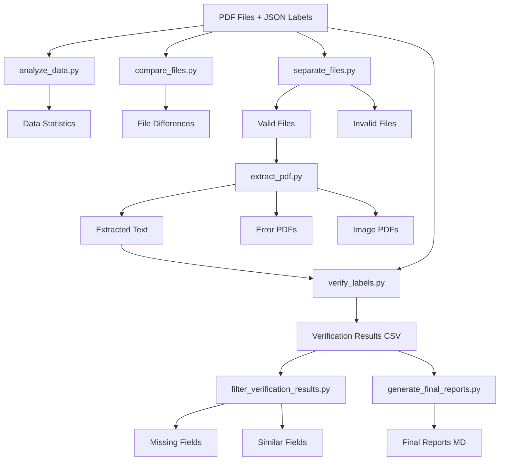

# Architecture Documentation - Invoice Data Audit Tool

## System Overview

Invoice Data Audit Tool là hệ thống xử lý và kiểm tra chất lượng dữ liệu hóa đơn tự động. Hệ thống sử dụng kiến trúc modular với các module độc lập có thể chạy riêng lẻ hoặc kết hợp trong pipeline.

## Data Flow Diagram



## Module Architecture

### Core Layer

#### 1. Configuration Module (`config.py`)

**Trách nhiệm**: Quản lý tất cả đường dẫn và cấu hình hệ thống

**Thiết kế**:

- Sử dụng `os.path.join` để đảm bảo cross-platform
- Tất cả paths đều relative từ `BASE_DIR`
- Tự động phát hiện thư mục gốc qua `sys.argv[0]`

**Key Constants**:

```python
BASE_DIR          # Thư mục gốc project
DATASET_DIR       # PDF files
LABEL_DIR         # JSON labels
REVIEW_DIR        # Output reports
EXTRACTED_TEXT_DIR # Extracted text files
```

---

#### 2. Utilities Module (`utils.py`)

**Trách nhiệm**: Cung cấp hàm tiện ích dùng chung

**Nhóm chức năng**:

1. **File Operations**:

   - `get_files_map(directory)` - Map basename → filenames (single level)
   - `get_files_map_recursive(directory)` - Map basename → filenames (recursive)
   - `list_files_recursive(directory, extension)` - List files by extension
   - `ensure_dir_exists(directory)` - Create directory if not exists

2. **File Movement**:

   - `copy_file_and_label()` - Copy PDF + JSON pair
   - `move_file_and_label()` - Move PDF + JSON pair
   - `move_file_safe()` - Safe file move with verification

3. **Date Processing**:

   - `parse_date_dmy(date_str)` - Parse "DD Mon YYYY" format
   - `validate_date(date_str)` - Validate and parse multiple formats

4. **Data Processing**:
   - `format_size(size_bytes)` - Convert bytes to human readable
   - `read_file(path)` - Read text file with error handling
   - `get_json_content_hash(json_path)` - MD5 hash of JSON content

---

### Processing Layer

#### 3. Analysis Module (`analyze_data.py`)

**Input**: Directories (Dataset, Label)
**Output**: CSV statistics, Text report

**Workflow**:

```
1. Scan directories
2. Collect file metadata (size, extension, basename)
3. Calculate statistics (count, size range, duplicates)
4. Generate report
```

**Key Functions**:

- `analyze_directories(output_csv, output_report)`

---

#### 4. Comparison Module (`compare_files.py`)

**Input**: Dataset and Label directories
**Output**: File differences report

**Workflow**:

```
1. Get file maps from both directories
2. Extract basenames (without extension)
3. Find set differences
4. Generate detailed report with file info
```

**Key Functions**:

- `compare_directories(output_file)`

---

#### 5. Extraction Module (`extract_pdf.py`)

**Input**: PDF files
**Output**: Text files, Error reports

**Workflow**:

```
1. List all PDFs recursively
2. For each PDF:
   a. Extract text using PyMuPDF
   b. Check if text is meaningful (> 50 chars)
   c. Classify: Text PDF / Image PDF / Error PDF
   d. Move to appropriate folder
3. Generate reports
```

**Classification Logic**:

- Text PDF: `len(text) >= 50` → Extract to `Extracted_Text/`
- Image PDF: `len(text) < 50` + has label → Move to `PDF_Image_Files/`
- No Label: `len(text) < 50` + no label → Move to `PDF_No_Label/`
- Error: Exception during extraction → Copy to `PDF_Error_Files/`

**Key Functions**:

- `extract_text_from_pdfs()`

---

#### 6. Verification Module (`verify_labels.py`)

**Input**: JSON labels, Extracted text files
**Output**: Verification CSV, Statistics report

**Workflow**:

```
1. Load JSON label
2. Flatten nested structure
3. For each field:
   a. Determine field type (date/numeric/text)
   b. Apply appropriate matching algorithm
   c. Record result and confidence
4. Write results to CSV
5. Generate statistics
```

**Matching Algorithms**: See [Matching Algorithms](#matching-algorithms) section

**Key Functions**:

- `verify_labels()`
- `get_best_match(value, text_content, field_name)`
- `is_numeric_match(value_str, text_content)`
- `match_date_formats(parsed_date, text_content, ...)`

---

### Filtering Layer

#### 7. Result Filter (`filter_verification_results.py`)

**Input**: Verification CSV
**Output**: Filtered CSVs (Missing, Similar)

**Workflow**:

```
1. Read verification CSV
2. Filter by Status column
3. Write to separate files
```

---

#### 8. Label Filter (`filter_verified_labels.py`)

**Input**: Verification CSV
**Output**: Verified files in separate folder

**Workflow**:

```
1. Group results by filename
2. Check if ALL fields are FOUND
3. Move verified PDF + JSON to Label_true/
```

---

### Utility Layer

#### 9. Duplicate Finder (`find_duplicates.py`)

**Input**: JSON labels
**Output**: Duplicate report, Moved duplicates

**Workflow**:

```
1. Calculate MD5 hash for each JSON (canonical form)
2. Group by hash
3. Keep first file (alphabetically), move others
```

---

#### 10. File Separator (`separate_files.py`)

**Input**: Dataset and Label directories
**Output**: Separated files by category

**Workflow**:

```
1. Build file maps (recursive)
2. Identify:
   - Files in Dataset without Label
   - DOCX files
   - Labels without PDF
3. Move to appropriate folders
```

---

## Matching Algorithms

### Date Matching

**Strategy**: Multi-format parsing with normalization

**Supported Formats**: See [supported_date_formats.md](supported_date_formats.md)

**Algorithm**:

```python
1. Parse JSON date to datetime object
2. Generate multiple format variations:
   - DD/MM/YYYY, MM/DD/YYYY
   - DD-MM-YYYY, DD.MM.YYYY
   - DD Mon YYYY, DD Month YYYY
   - Month DD, YYYY
   - Ordinal formats (1st, 2nd, 3rd)
3. Search each format in text
4. Return first match with format info
```

**Special Handling**:

- Soft hyphen (`\xad`) removal
- 2-digit year conversion (00-50 → 2000-2050, 51-99 → 1951-1999)
- Case-insensitive month names

---

### Numeric Matching

**Strategy**: Normalize and compare numerical values

**Algorithm**:

```python
1. Parse JSON value to float
2. Find all number patterns in text using regex
3. For each pattern:
   a. Remove commas
   b. Handle accounting format: (123) → -123
   c. Parse to float
   d. Compare with tolerance (epsilon = 0.01)
4. Return match if found
```

**Supported Formats**:

- `1,234.56` → `1234.56`
- `(1,234.56)` → `-1234.56`
- `1234` → `1234.0`
- Unicode minus signs

---

### Text Matching

**Strategy**: Exact → Case-insensitive → Fuzzy

**Algorithm**:

```python
1. Exact match (case-sensitive)
   → Return FOUND

2. Case-insensitive match
   → Return FOUND_CASE_INSENSITIVE

3. Fuzzy match (difflib.SequenceMatcher)
   → If ratio > 0.8: Return SIMILAR
   → Else: Return MISSING
```

**Normalization**:

- Whitespace normalization (multiple spaces → single space)
- Newline handling
- Unicode normalization

---

## Extension Guidelines

### Adding New Date Format

1. Update `match_date_formats()` in `verify_labels.py`:

```python
# Add new format pattern
new_formats = [
    # Your new format here
    (r"pattern", "format_name")
]
```

2. Add test cases
3. Update `supported_date_formats.md`

---

### Adding New Field Type

1. Add field name to appropriate list in `verify_labels.py`:

```python
DATE_RELATED_FIELDS = [...]
PERCENTAGE_FIELDS = [...]
# Add new list if needed
CURRENCY_FIELDS = [...]
```

2. Implement matching logic in `get_best_match()`:

```python
if field_name.lower() in CURRENCY_FIELDS:
    # Your currency matching logic
    pass
```

---

### Adding New Module

1. Create module file in root directory
2. Import `config` and `utils`
3. Implement main function
4. Add to `main_pipeline.py` if needed
5. Update README.md with usage instructions

---

## Performance Considerations

### Memory Usage

- **Large datasets**: Process files in batches
- **Text extraction**: Files processed one at a time
- **Verification**: Results written incrementally to CSV

### Optimization Opportunities

1. **Parallel Processing**:

   - Extract PDFs in parallel (use `multiprocessing`)
   - Verify labels in parallel

2. **Caching**:

   - Cache parsed dates
   - Cache file maps

3. **Indexing**:
   - Build text index for faster searching
   - Use database for large verification results

---

## Error Handling Strategy

### Levels

1. **File Level**: Continue processing other files if one fails
2. **Field Level**: Record error but continue with other fields
3. **Critical**: Stop pipeline (e.g., config error, missing directories)

### Logging

Currently uses `print()`. Consider migrating to Python `logging` module:

```python
import logging

logging.basicConfig(
    level=logging.INFO,
    format='%(asctime)s - %(name)s - %(levelname)s - %(message)s',
    handlers=[
        logging.FileHandler('pipeline.log'),
        logging.StreamHandler()
    ]
)
```

---

## Testing Strategy

### Current State

No automated tests. Verification relies on:

- Manual testing with sample data
- Comparing output with previous runs

### Recommended Tests

1. **Unit Tests**:

   - Date parsing functions
   - Numeric matching
   - File operations

2. **Integration Tests**:

   - Full pipeline with sample data
   - Module interactions

3. **Regression Tests**:
   - Known edge cases
   - Previously fixed bugs

---

## Dependencies

### Core Dependencies

| Package      | Version | Purpose                       |
| ------------ | ------- | ----------------------------- |
| `pymupdf`    | Latest  | PDF text extraction (primary) |
| `pdfplumber` | Latest  | PDF processing (backup)       |
| `PyPDF2`     | 3.0.1   | PDF manipulation              |

### Standard Library

- `os`, `sys` - File system operations
- `json` - JSON parsing
- `csv` - CSV file handling
- `difflib` - Fuzzy string matching
- `re` - Regular expressions
- `datetime` - Date parsing
- `hashlib` - MD5 hashing
- `shutil` - File operations

---

## Future Enhancements

1. **Web Interface**: Flask/FastAPI dashboard for monitoring
2. **Database Integration**: Store results in SQLite/PostgreSQL
3. **OCR Support**: Integrate Tesseract for image PDFs
4. **Machine Learning**: Train model for field extraction
5. **API**: REST API for programmatic access
6. **Batch Processing**: Queue system for large datasets
7. **Real-time Monitoring**: Progress tracking and notifications
